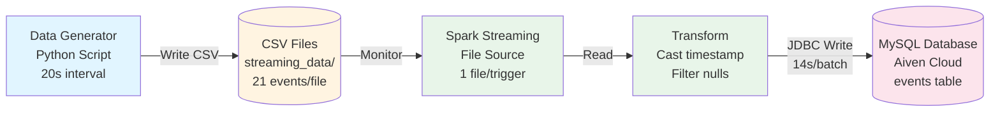

# System Architecture Diagram

## Mermaid Diagram Code
Copy this code to https://mermaid.live or any Mermaid renderer to generate PNG



## ASCII Diagram

```
┌─────────────────────────────────────────────────────────────────┐
│                    REAL-TIME DATA INGESTION SYSTEM               │
└─────────────────────────────────────────────────────────────────┘

┌──────────────────┐
│ Data Generator   │
│ (Python)         │
│                  │
│ • 20s interval   │
│ • 21 events/file │
│ • Random data    │
└────────┬─────────┘
         │
         │ Writes CSV
         ▼
┌──────────────────┐
│  File System     │
│                  │
│  streaming_data/ │
│  ├─ events_*.csv │
│  ├─ events_*.csv │
│  └─ events_*.csv │
└────────┬─────────┘
         │
         │ Monitors
         ▼
┌──────────────────────────────────────────────────────┐
│         Apache Spark Structured Streaming            │
│                                                       │
│  ┌─────────────┐    ┌──────────────┐    ┌────────┐ │
│  │ File Stream │───▶│ Transform    │───▶│ Batch  │ │
│  │ Source      │    │ • Timestamp  │    │ Writer │ │
│  │ (1 file/    │    │ • Filter     │    │ (JDBC) │ │
│  │  trigger)   │    │   nulls      │    │        │ │
│  └─────────────┘    └──────────────┘    └───┬────┘ │
│                                              │      │
│  Batch Duration: ~16 seconds                 │      │
└──────────────────────────────────────────────┼──────┘
                                               │
                                               │ JDBC Write
                                               ▼
                                    ┌──────────────────┐
                                    │ MySQL Database   │
                                    │ (Aiven Cloud)    │
                                    │                  │
                                    │  events table    │
                                    │  • event_id (PK) │
                                    │  • user_id       │
                                    │  • product_id    │
                                    │  • event_type    │
                                    │  • price         │
                                    │  • event_time    │
                                    └──────────────────┘
```

## Component Details

### 1. Data Generator
- **File**: data_generator.py
- **Function**: Generates synthetic e-commerce events
- **Output**: CSV files every 20 seconds
- **Volume**: 21 events per file

### 2. File System Storage
- **Location**: streaming_data/
- **Format**: CSV with headers
- **Naming**: events_<timestamp>.csv
- **Size**: ~2KB per file

### 3. Spark Streaming
- **Version**: Spark 4.1.1
- **Mode**: Micro-batch processing
- **Trigger**: File-based (1 file per trigger)
- **Transformations**:
  - Cast event_time to timestamp
  - Filter null user_id records
- **Write**: foreachBatch to MySQL

### 4. MySQL Database
- **Provider**: Aiven Cloud
- **Connection**: JDBC with SSL
- **Table**: events
- **Primary Key**: event_id (prevents duplicates)

## Data Flow Metrics
- **Throughput**: 63 events/minute
- **Latency**: 14-16 seconds per batch
- **Bottleneck**: Database write (~14s)
- **Reliability**: Checkpoint-based fault tolerance

## To Generate PNG:
1. Visit https://mermaid.live
2. Paste the Mermaid code above
3. Export as PNG/SVG
4. Save as system_architecture.png
